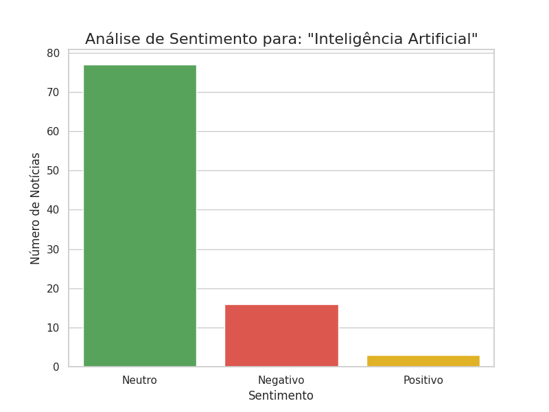

# Análise de Sentimento de Notícias

Este projeto coleta notícias usando a [NewsAPI](https://newsapi.org/), realiza **análise de sentimento** nos títulos com a ferramenta **VADER** (do NLTK) e exibe os resultados em um gráfico de barras.

## Funcionalidades

- Busca automática de notícias em português sobre IA
- Classificação de sentimento: Positivo, Neutro ou Negativo
- Geração de gráfico de barras com contagem de sentimentos

## Requisitos

- Python 3.8+
- Conta gratuita na [NewsAPI](https://newsapi.org/) para obter uma API key

## Exemplo de resultado

